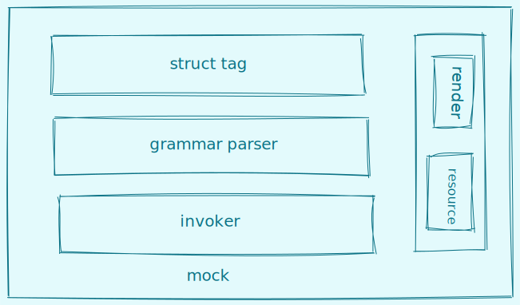

# MockTag
MockTag是指在struct中定义好mock表达式，mocker可以根据表达式规则生成指定值

# 结构图


# zeroValue vs mock

## zeroValue
```json
{
    "RandomBool":false,
    "SpecBool":false,
    "BoolTrue":false,
    "SpecString":"",
    "SpecInt":0,
    "AliasInt":0,
    "SpecFloat":0,
    "SliceInt":null,
    "RangeInt":0,
    "RandomInt":0,
    "Map":null,
    "ObjectIdHex":"",
    "SlicePersonName":null,
    "ClassName":"",
    "GradeName":"",
    "GradeClassName":"",
    "Url":"",
    "Image":"",
    "Sum":0,
    "Email":"",
    "Phone":"",
    "Mobile":"",
    "Ipv4":"",
    "Ipv6":"",
    "Latitude":"",
    "Longitude":"",
    "UUID":"",
    "Now":"",
    "Date":"",
    "Unix":"",
    "Year":"",
    "Month":"",
    "Day":"",
    "Hour":"",
    "Minute":"",
    "Second":"",
    "Age":"",
    "Province":"",
    "City":"",
    "District":"",
    "Address":"",
    "Provinces":null,
    "Cities":null,
    "Addresses":null,
    "StringPointer":null,
    "PointInt":null,
    "PointFloat":null,
    "MapPointer":null,
    "PointerStruct":null,
    "NormalStruct":{
        "Name":"",
        "Gender":""
    },
    "AliasMap":null,
    "ArrayPointer":[
        null,
        null
    ],
    "ArrayStruct":[
        null
    ]
}
```
## mock
```json
{
  "RandomBool":false,
  "SpecBool":true,
  "BoolTrue":true,
  "SpecString":"I am spec string",
  "SpecInt":123,
  "AliasInt":5,
  "SpecFloat":123.2,
  "SliceInt":[
    17,
    12
  ],
  "RangeInt":99,
  "RandomInt":34170625,
  "Map":{
    "5f8bd7b994d7e13eaa2674b0":19,
    "5f8bd7b994d7e13eaa2674b1":17,
    "5f8bd7b994d7e13eaa2674b2":17
  },
  "ObjectIdHex":"5f8bd7b994d7e13eaa2674b3",
  "SlicePersonName":[
    "那琸笑",
    "范林筱",
    "郭翔凯",
    "皇采博",
    "凌玲信",
    "辕健珏",
    "柳霆航",
    "双逦冬",
    "安恬语",
    "纪颖基"
  ],
  "ClassName":"6班",
  "GradeName":"四年级",
  "GradeClassName":"一年级7班",
  "Url":"https://extent.idea.net",
  "Image":"https://title.zh.name/xx.png",
  "Sum":6,
  "Email":"wolunwei@googlemail.com",
  "Phone":"(0837)6150243",
  "Mobile":"(+86)12320641857",
  "Ipv4":"217.125.250.33",
  "Ipv6":"9BE8:23ED:A905:CBF5:7576:169C:4E1D:22BF",
  "Latitude":"5.62471053",
  "Longitude":"144.70315642",
  "UUID":"12cfae10-b110-4a7d-baaa-41669d4dfa72",
  "Now":"2020-10-18 13:50:49.397287 +0800 CST m=+0.009482879",
  "Date":"2020-10-18",
  "Unix":"1603000249",
  "Year":"2020",
  "Month":"10",
  "Day":"18",
  "Hour":"13",
  "Minute":"50",
  "Second":"49",
  "Age":"95",
  "Province":"黑龙江省",
  "City":"武汉市",
  "District":"通海县",
  "Address":"青海省西宁市城西区",
  "Provinces":[
    "湖南省",
    "广东省",
    "四川省"
  ],
  "Cities":[
    "北京市",
    "抚顺市",
    "福州市"
  ],
  "Addresses":[
    "重庆市酉阳土家族苗族自治县",
    "四川省遂宁市蓬溪县",
    "黑龙江省哈尔滨市道里区",
    "广西壮族自治区河池市大化瑶族自治县",
    "重庆市城口县"
  ],
  "StringPointer":[
    "福建省",
    "贵州省",
    "吉林省",
    "内蒙古自治区",
    "广西壮族自治区"
  ],
  "PointInt":39411702681510,
  "PointFloat":4.321,
  "MapPointer":{
    "102":4.3102,
    "120":743.12,
    "621":140.23
  },
  "PointerStruct":{
    "Name":"甘磊苓",
    "Gender":"男"
  },
  "NormalStruct":{
    "Name":"阮成莺",
    "Gender":"女"
  },
  "AliasMap":{
    "广西壮族自治区":[
      {
        "Name":"简高兆",
        "Gender":"女"
      },
      {
        "Name":"籍金升",
        "Gender":"女"
      },
      {
        "Name":"霍水杨",
        "Gender":"女"
      },
      {
        "Name":"仲诒昕",
        "Gender":"女"
      },
      {
        "Name":"蓝标朝",
        "Gender":"男"
      }
    ],
    "海南省":[
      {
        "Name":"于琰烟",
        "Gender":"女"
      },
      {
        "Name":"童珺翠",
        "Gender":"女"
      },
      {
        "Name":"古瑗芸",
        "Gender":"男"
      },
      {
        "Name":"阳致武",
        "Gender":"女"
      },
      {
        "Name":"公丫磊",
        "Gender":"女"
      }
    ],
    "澳门特别行政区":[
      {
        "Name":"连沂迪",
        "Gender":"女"
      },
      {
        "Name":"巴朗议",
        "Gender":"女"
      },
      {
        "Name":"云津靖",
        "Gender":"男"
      },
      {
        "Name":"厍平朦",
        "Gender":"女"
      },
      {
        "Name":"法婉迅",
        "Gender":"男"
      }
    ]
  },
  "ArrayPointer":[
    [
      {
        "Name":"黎理环",
        "Gender":"男"
      },
      {
        "Name":"慎金升",
        "Gender":"男"
      },
      {
        "Name":"禹茂晶",
        "Gender":"女"
      }
    ],
    [
      {
        "Name":"容焕景",
        "Gender":"女"
      },
      {
        "Name":"水妤健",
        "Gender":"男"
      },
      {
        "Name":"戴咏蕊",
        "Gender":"女"
      }
    ]
  ],
  "ArrayStruct":[
    [
      {
        "Name":"倪朝权",
        "Gender":"男"
      },
      {
        "Name":"游亦茗",
        "Gender":"男"
      }
    ]
  ]
}
```
# mock表达式语法概述
mockExpression=`$mockName$rule`
$mockName必须要有对应的函数执行体名称与之对应，否则没有值生成，函数名称的首字母不区分大小写.

# 常用字段说明
* $length: 长度，正整数类型
* $start: 范围开始值，整数
* $end: 范围结束值，整数
* ${text}: 常量值
* $arg: 参数
* $mockName: mock表达式，用于匹配func执行体,详见<a href="#name">$mockName</a>
* $rule: 表达式规则,详见<a href="#rule">$rule</a>
* $itemMockExpression: 数组和切片的item表达式
* $invokeFuncName: 函数执行体名称
* zh:语言常量，中文
* en:语言常量，英文
* number:语言常量，数字

# 关键字
* bool
* slice
* map
* spec
* zh
* en
* number
* true
* false


# name
定义一个语法表达式名称,当`$rule`为模板`${text}?<<$invokeFuncName>>${text}?`表达式时，无需定义此名称

## 命名规则
* 1、小写字母开头
* 2、由字母、数字、下划线(_)组成


# rule
可选，定义一个语法表达式的规则

## 规则语法

### number类型

| rule expression   | description | example      |
|-------------------|-------------|--------------|
| [$start,$end]     | 范围,闭区间，正整数 | [0,100]      |
| ($length)         | 指定长度，正整数    | (10)            |

### string类型

| rule expression   | description      | example |
|-------------------|------------------|---------|
| (en\|zh\|number->[$start,$end]) | 指定语言、长度在某区间(正整数闭区间)字符串 | (zh->[1,3])|
| (en\|zh\|number\|mix->$length) | 指定语言、长度（正整数）的字符串,mix:混合类型，->length可选,生成内容长度由开发者解析时决定 | (en->10)\|(en) |
| ${text}?<<$invokeFuncName>>${text}? | 模板语法，$invokeFuncName:定义好的方法执行体名称，名称首字母不区分大小写，${text}:文本常量，在模板生成时直接带入，可选 | <\<randomName\>>{@qq.com} |


### custom类型

对slice、map、struct无效

| rule expression   | description      | example |
|-------------------|------------------|---------|
| (${arg}...) | 自定义参数$,$arg必填,多个参数以英文逗号分割 | ({1},{2},{3}) |

 
# 内置表达式

* 布尔随机:`randomBool`，仅bool类型可用
* 布尔指定值:`bool=true|false`，仅bool类型可用
* 切片|数组类型:`slice($length,$itemMockExpression)`，仅切片类型可用,$length在类型为array时可选,$itemMockExpression为item的随机值规则，也要遵循对应item类型的表达式声明
* map类型: `map($length,$keyMockExpression,$valueMockExpression)`，仅map类型可用,$keyMockExpression、$valueMockExpression分别为key、value的随机值规则，也要遵循对应item类型的表达式声明
* 指定值: `spec={$value}`，指定值声明
* 生成指定范围随机整数数: `rangeInt[$start,$end]`
* 生成指定长度随机整数数: `randomInt($length)`
* 生成指定长度随机浮点数: `randomFloat($length)`
* 生成ObjectIdHex: `objectIdHex`
* 生成随机人名: `personName($lang)`
* 随机生成班级名称: `className`
* 随机生成年级名称: `gradeName($lang)`
* 随机生成年级班级名称: `gradeClassName($lang)`
* 随机生成网址: `url`
* 随机邮箱: `email`
* 随机座机号: `phone`
* 随机手机号: `mobile`
* 随机ipv4: `ipv4`
* 随机ipv6: `ipv6`
* 随机经度: `latitude`
* 随机纬度: `longitude`
* uuid生成: `uuid`
* 当时间时间: `now`
* 当前date: `date`
* 当前time.Unix(): `unix`
* 当前year: `year`
* 当前month: `month`
* 当前dayOfMonth: `day`
* 当前hour: `hour`
* 当前mintute: `minute`
* 当前second: `second`
* 随机gender: `gender($lang)`
* 随机年龄: `age`
* 随机省: `province`
* 随机市: `city`
* 随机区: `district`
* 随机地址: `address`


# 语法表达式声明example

* 定义随机布尔值生成(preset)

    `randomBool`

* 定指定布尔值为true(preset)

    `bool=true`

* 定义指定数组长度为3,item为10-20之间随机数(preset)

    `slice(3,randomInt[10,20])`

* 定义指定map长度为3,key为10-20之间的随机数字，value为8为随机字符串(preset)

    `map(3,randomInt[10,20],randomString(en->8))`

* 指定值(preset)

    `spec={Copyright 2020 xiaoxin \n Code generated by goctl. DO NOT EDIT.}`

* 定义随机数范围(custom)

    `randomNumber[1,100]`

* 定义指定长度的id(custom)

    `randomId(8)`

* 定义中文人名生成(custom)

    `randomPerson_ZH(zh->[1,3])`

* 定义英文人名生成(custom)

    `randomPerson_EN(en->[1,10])`

* 定义ObjectHexId(custom)

    `objectHexId`

* 定义随机语句(custom)

    `randomSentence(en)`

* 定义随机生成10为数字符串(custom)

    `randomNumber10(number)`

* 定义随机生成11位手机号(custom)

    `<<randomPhone>>`

* 定义求和表达式(custom)

    `sum({1},{2},{3})`

# 自定义mock标签

expresson=`$mockName$rule`

## 准备条件

* $mockName标签名称命名规则需遵循<a href="#命名规则">命名规则</a>，$rule必须要遵循rule的语法，见<a href="#rule">rule</a>
* 定义值生产函数执行体，函数名称$funcName与$mockName需要满足 unTitle($funcName)==unTitle($mockName),注意：暂时不支持匿名函数
* 在struct中使用标签
* 注册值生产函数执行体

## 定义animalName的标签

* 定义值生产函数执行体

```golang
func AnimalName(ctx *render.MockContext)interface{}{
	r:=rand.New(rand.NewSource(time.Now().UnixNano()))
	animals:=[]string{"熊猫","大象","老虎","程序猿"}
	index:=r.Intn(4)
	return animals[index]
}
```

* 定义struct并使用标签

```
type (
	Animal struct {
		Name string `mock:"animalName"`
	}
)

```

* 注册AnimalName函数，并生成数据

```
func main() {
	data := &Animal{}
	m:=mock.With(data, expand.AnimalName)
	err:=m.Mock()
	if err!=nil{
		log.Fatal(err)
	}
	bts,_:=json.Marshal(data)
	fmt.Println(string(bts))
}
```

## 运行结果

```
{"Name":"程序猿"}
```
